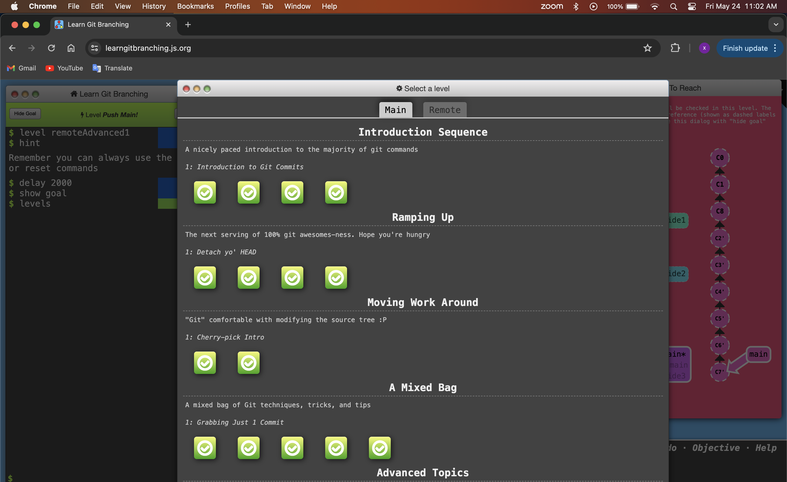
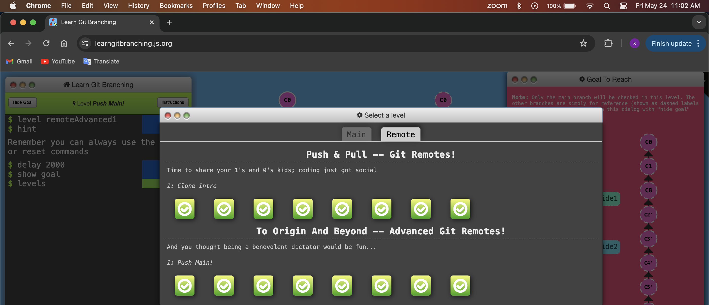

# exercise2

## Screenshot of learning branches:

### main

### remote

## Question 1: 

For the level Grabbing Just 1 commit, I used git cherry-pick. 
-	First , I switch to the main branch using git checkout main 
-	Then, I did git cherry-pick c4, that select the commit c4 that is bug free and will copy it under your current location that is main. 
Recap: 
-	git checkout main 
-	git cherry-pick c4

## Question 2:

For the level Juggling Commits. 
-	First, I used git rebase -i caption^^ that will go 2 commits before caption 
-	After, I did git commit --amend for the modification
-	Follow by  git rebase -i caption^^ that will go 2 commits before caption that was amend
-	Then, I move main using git branch -f main caption

Recap: 
-	git rebase -i caption^^
-	git commit --amend 
-	git rebase -I caption^^
-	git branch -f main caption

## Question 3: 

For the level Juggling Commits. 
-	First, I switch to the main branch using git checkout main 
-	After, I select only the commit c2 to put it under the main branch using git cherry-pick c2
-	Follow by git -f main HEAD^ to move back the main branch 
-	Then, I select cherry-pick c2’ c3

Recap: 
-	Git checkout main 
-	Git cherry-pick c2
-	Git branch -f main HEAD^
-	Git cherry-pick c2’ c3
